# Mermaid Diagram Generator Skill

## 概要

このSkillは、Mermaid記法を使用してUML図およびデータモデル図を生成します。

**最重要原則**: シンプルさを優先し、表示エラーを回避

## 対応図タイプ（12種類）

### Mermaidでサポートされている図

1. **ユースケース図** - 非公式だが作成可能
2. **クラス図** - `classDiagram`
3. **シーケンス図** - `sequenceDiagram`
4. **アクティビティ図** - `flowchart` / `graph`で代替
5. **ステートマシン図** - `stateDiagram-v2`
6. ~~コンポーネント図~~ - 公式サポートなし（`graph`で代替）
7. ~~配置図~~ - 公式サポートなし（`graph`で代替）
8. ~~オブジェクト図~~ - `classDiagram`で代替
9. ~~パッケージ図~~ - `graph`で代替
10. ~~コミュニケーション図~~ - 公式サポートなし
11. **ER図** - `erDiagram`
12. **データモデル図** - `erDiagram`で代替

### サポート状況まとめ

| 図タイプ | Mermaid対応 | 代替手段 |
|---------|-------------|----------|
| ユースケース図 | ⚠️ 非公式 | `flowchart` |
| クラス図 | ✅ | `classDiagram` |
| シーケンス図 | ✅ | `sequenceDiagram` |
| アクティビティ図 | ✅ | `flowchart` |
| ステートマシン図 | ✅ | `stateDiagram-v2` |
| コンポーネント図 | ❌ | `flowchart` |
| 配置図 | ❌ | `flowchart` |
| オブジェクト図 | ⚠️ | `classDiagram` |
| パッケージ図 | ❌ | `flowchart` |
| コミュニケーション図 | ❌ | `sequenceDiagram` |
| ER図 | ✅ | `erDiagram` |
| データモデル図 | ✅ | `erDiagram` |

## 使用タイミング

以下のようなリクエストで使用してください：

- 「システムのクラス図をMermaidで作成してください」
- 「APIのシーケンス図を生成してください」
- 「データベースのER図をMermaidで作りたい」
- 「GitHubで表示できる状態遷移図を作成してください」

## シンプル化の原則（最重要）

### ❌ 避けるべき複雑さ

1. **要素が多すぎる**
   - 20個以上のノード → エラーの原因
   - 解決策: 図を複数に分割

2. **ネストが深すぎる**
   - 4階層以上 → レンダリング失敗
   - 解決策: 階層を浅くする

3. **線が交差しすぎる**
   - 可読性が低下
   - 解決策: レイアウトを工夫

4. **テキストが長すぎる**
   - 50文字以上 → 表示崩れ
   - 解決策: 改行または省略

### ✅ シンプルな図の特徴

- **要素数**: 10-15個以内
- **階層**: 2-3階層まで
- **ラベル**: 30文字以内
- **リレーション**: 要素ごとに2-3本まで

## 実行プロセス

### ステップ1: 複雑度チェック

図を生成する前に、要素数をチェック：

```javascript
// 複雑度評価
function assessComplexity(requirements) {
  const elementCount = requirements.elements.length;
  const relationshipCount = requirements.relationships.length;
  const nestingDepth = calculateMaxDepth(requirements.elements);
  
  const complexity = {
    level: 'simple',
    warnings: []
  };
  
  if (elementCount > 20) {
    complexity.level = 'high';
    complexity.warnings.push('要素数が多すぎます。図を分割することを推奨します。');
  }
  
  if (nestingDepth > 3) {
    complexity.warnings.push('ネストが深すぎます。階層を浅くしてください。');
  }
  
  if (relationshipCount > elementCount * 2) {
    complexity.warnings.push('関係が多すぎます。主要な関係のみに絞ってください。');
  }
  
  return complexity;
}
```

### ステップ2: 簡素化戦略

複雑な図を分割：

```javascript
// 図の分割戦略
function simplifyDiagram(complexDiagram) {
  // 1. レイヤーで分割
  const layers = groupByLayer(complexDiagram.elements);
  
  // 2. 関心事で分割
  const concerns = groupByConcern(complexDiagram.elements);
  
  // 3. 推奨する分割
  return {
    option1: {
      name: '機能別分割',
      diagrams: splitByFunction(complexDiagram)
    },
    option2: {
      name: 'レイヤー別分割',
      diagrams: splitByLayer(complexDiagram)
    }
  };
}
```

### ステップ3: Mermaid記法生成

シンプルな記法で生成：

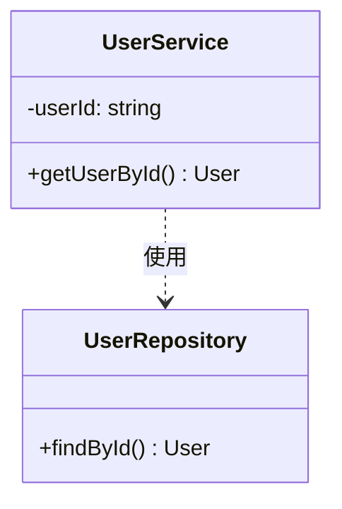

### ステップ4: バリデーション（強化版）⚠️ 重要

生成したMermaidコードを**必ず**以下の手順で検証してください。これにより構文エラーを防ぎます。

#### 4-1. 基本構文チェック ✅

以下を**すべて**確認：

- [ ] **コードブロック**: ````mermaid``` で正しく囲まれている
- [ ] **ダイアグラム宣言**: 先頭行が有効な宣言（classDiagram, sequenceDiagram, stateDiagram-v2, erDiagram, flowchart TB/LR）
- [ ] **矢印記法**: 有効な矢印のみ使用（`-->`, `-.->`, `==>`, `--o`, `--|>`, `..|>`, `..>`）
- [ ] **引用符**: すべての引用符が正しく閉じられている（`"..."` または `[...]`）
- [ ] **特殊文字のエスケープ**: `#`, `{`, `}`, `<`, `>`, `(`, `)` が適切に扱われている
  - クラス図の属性・メソッド内では `()` `<>` を使用可能
  - ラベル内では `#quot;` でエスケープ
- [ ] **コメント**: `%%` で始まる行のみ（`//` や `<!-- -->` は使用不可）
- [ ] **改行とインデント**: 適切な改行とインデントがある（1行が長すぎない）

#### 4-2. 複雑度チェック 📊

図タイプ別の制限を確認：

**クラス図**:
- [ ] クラス数 ≤ 12個
- [ ] 各クラスの属性 ≤ 5個
- [ ] 各クラスのメソッド ≤ 5個
- [ ] リレーション ≤ 15本

**シーケンス図**:
- [ ] 参加者 ≤ 7人
- [ ] メッセージ ≤ 15本
- [ ] ネスト（alt/loop/opt）≤ 2階層

**ステートマシン図**:
- [ ] 状態 ≤ 10個
- [ ] 遷移 ≤ 15本
- [ ] 複合状態のネスト ≤ 1階層

**ER図**:
- [ ] エンティティ ≤ 10個
- [ ] 各エンティティの属性 ≤ 8個
- [ ] リレーション ≤ 12本

**フローチャート**:
- [ ] ノード ≤ 15個
- [ ] エッジ ≤ 20本
- [ ] サブグラフのネスト ≤ 2階層

#### 4-3. プラットフォーム互換性チェック 🌐

対象プラットフォームに応じて確認：

**GitHub**:
- [ ] 総ノード数 < 20個（GitHubの暗黙の制限）
- [ ] レンダリング時間 < 3秒（複雑すぎないこと）
- [ ] ラベルの長さ ≤ 30文字

**VS Code / Cursor**:
- [ ] 日本語ラベルはUTF-8エンコーディング
- [ ] 特殊文字の使用を最小限に

**一般**:
- [ ] 改行は `<br>` ではなく改行文字を使用
- [ ] HTMLタグは使用しない

#### 4-4. エラー発見時のアクション 🔧

エラーまたは警告を発見した場合：

1. **即座に修正**: 上記チェックリストに基づいて問題箇所を修正
2. **Mermaid Live Editorで検証**:
   ```
   https://mermaid.live/
   ```
   - 生成したコードを貼り付けて表示を確認
   - エラーが表示される場合は詳細を確認して修正
3. **再バリデーション**: 修正後、このチェックリスト全体を再実行
4. **簡素化の検討**: 修正が難しい場合は、図を分割するか要素を減らす

#### 4-5. オプション：自動バリデーター 🤖

より厳密な検証が必要な場合、軽量バリデータースクリプトを使用可能：

```bash
# validators/mermaid-validator.jsが利用可能な場合
node validators/mermaid-validator.js output.mmd

# 複雑度のみチェック
node validators/complexity-checker.js output.mmd
```

**注**: これらのスクリプトはオプションです。Node.js環境がある場合のみ使用できます。

#### 4-6. バリデーション成功の確認 ✅

すべてのチェックが完了したら：

- [ ] すべての基本構文チェックに✅
- [ ] 複雑度が制限内に収まっている
- [ ] プラットフォーム互換性に問題なし
- [ ] Mermaid Live Editorで正常に表示される

**すべてのチェックが✅なら、図の生成は完了です！**

## 図タイプ別実装

### 1. ユースケース図

Mermaidの公式サポートはないため、`flowchart`で代替：

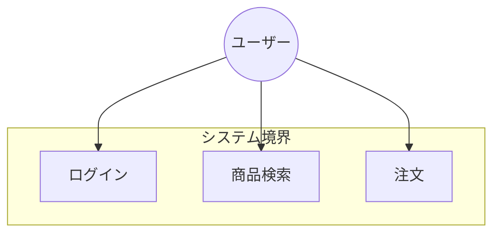

**簡素化ルール**:
- ユースケース数: 最大10個
- アクター数: 最大3-4個
- «include»/«extend»は最小限に

### 2. クラス図

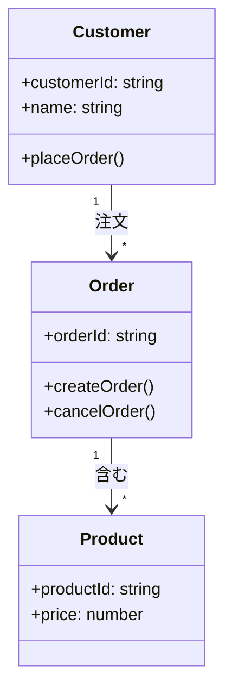

**簡素化ルール**:
- クラス数: 10個以内
- 属性: 1クラスあたり5個以内
- メソッド: 1クラスあたり5個以内
- リレーション: 各クラス最大3本

**テキストルール**:
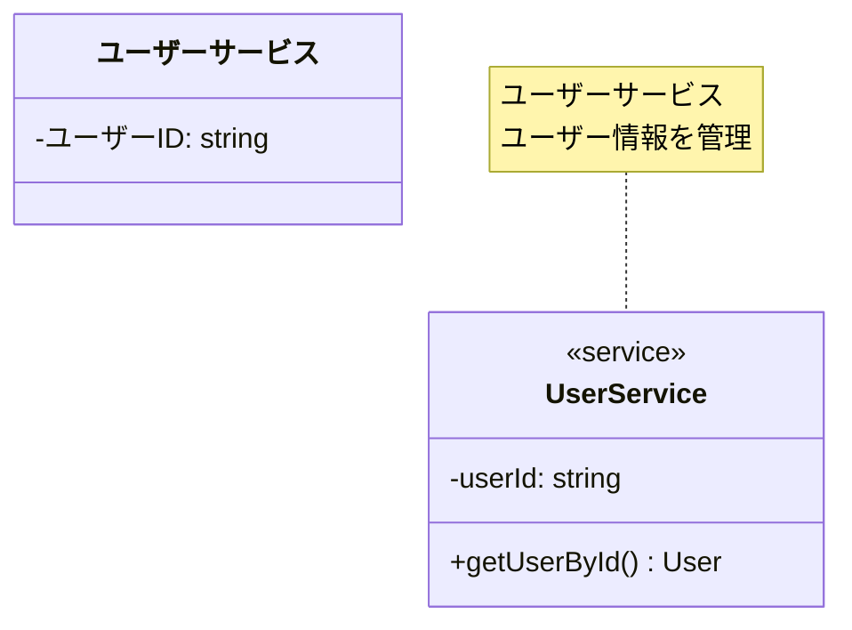

### 3. シーケンス図

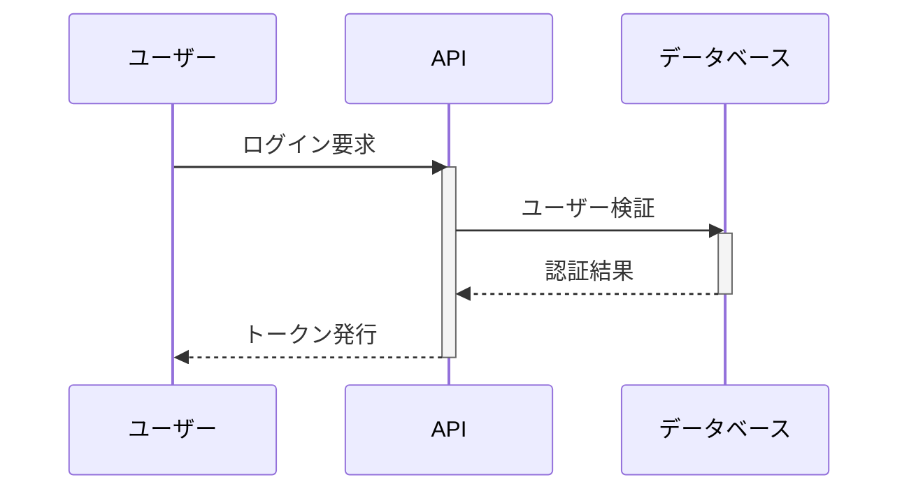

**簡素化ルール**:
- 参加者: 最大6個
- メッセージ: 最大15個
- ネストしたactivate: 最大2階層
- ループ/条件分岐: 最小限に

**避けるべきパターン**:
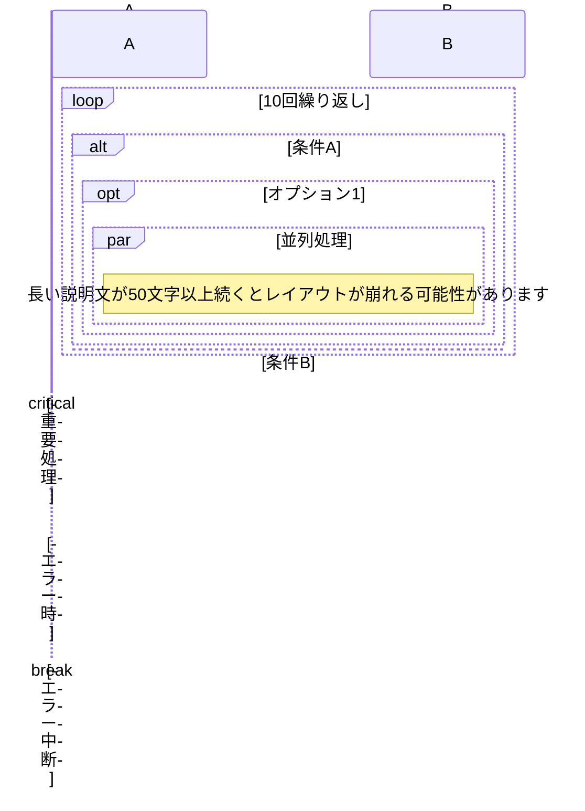

### 4. アクティビティ図

`flowchart`で代替：

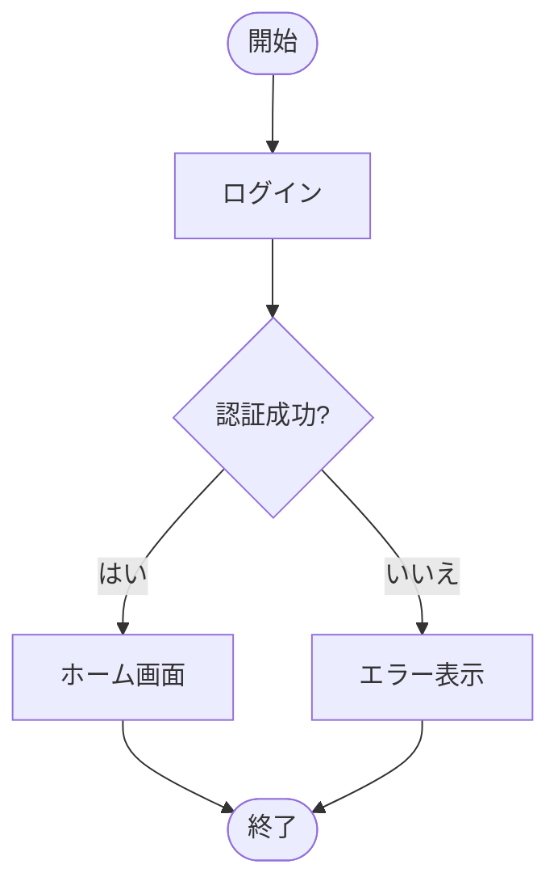

**簡素化ルール**:
- ノード数: 15個以内
- 分岐: 各判断ノード2-3個まで
- 並列処理: 使用しない（複雑化の原因）

### 5. ステートマシン図

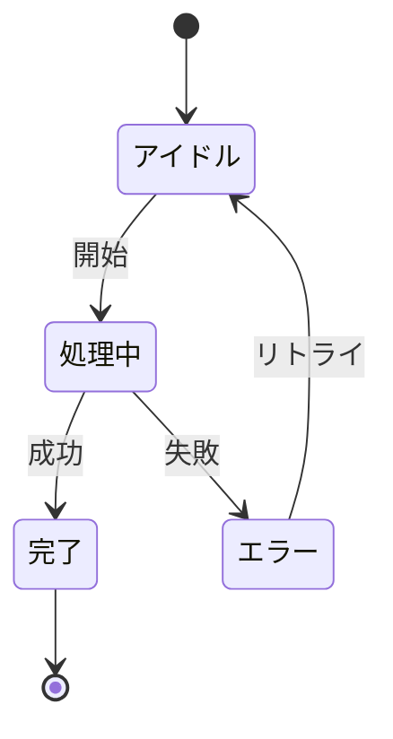

**簡素化ルール**:
- 状態数: 10個以内
- 遷移: 各状態から3本まで
- 複合状態: 使用しない（1階層のみ）

### 6. ER図（データモデル図）

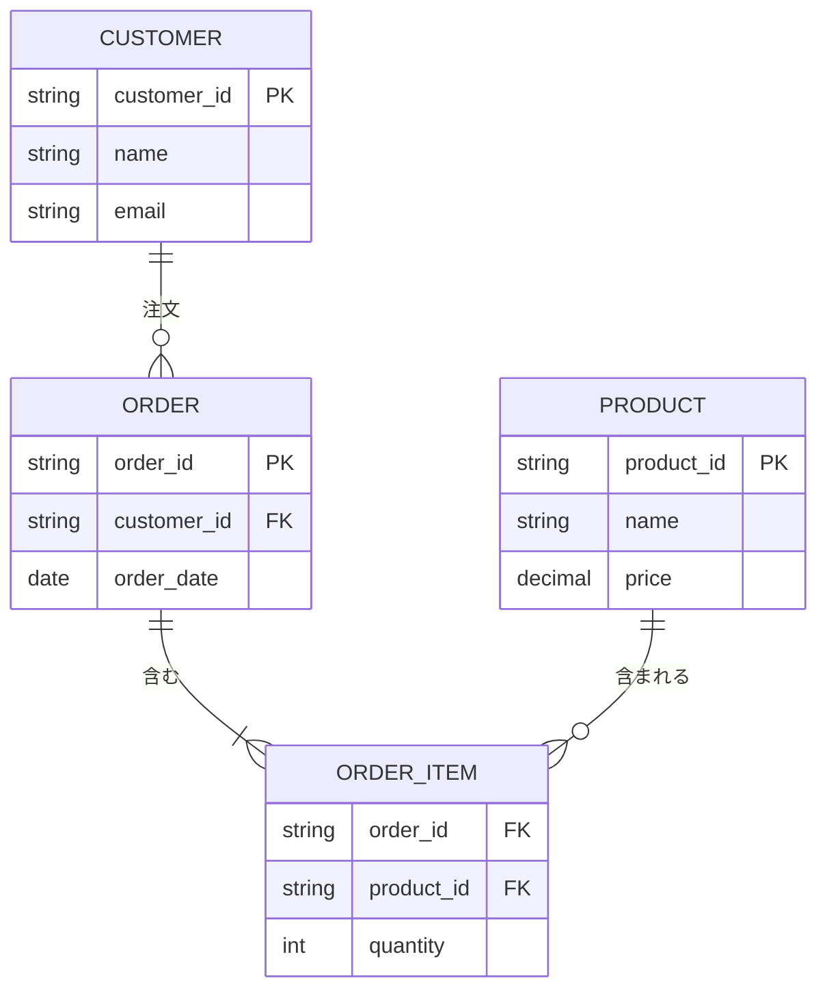

**簡素化ルール**:
- エンティティ数: 8個以内
- 属性: 1エンティティあたり6個以内
- リレーション: 各エンティティ3本まで
- カーディナリティ: シンプルな記法のみ（`||--o{`など）

**テキストルール**:
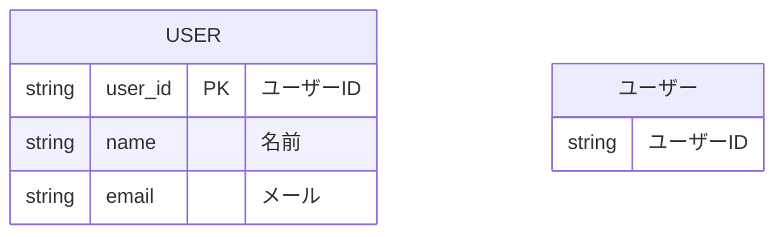

### 7. コンポーネント図・パッケージ図

`flowchart`で代替：

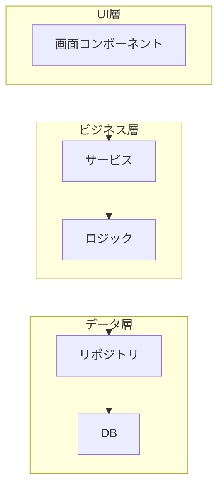

**簡素化ルール**:
- レイヤー数: 3-4個
- コンポーネント数: 各レイヤー3-5個
- 依存関係: 主要なもののみ

## 表示プラットフォーム別の最適化

### GitHub対応

```markdown
# システム設計

## クラス図

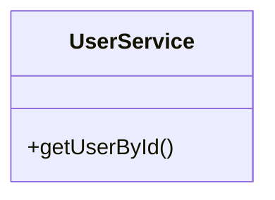
```

**GitHubでの注意点**:
- 複雑な図は表示されない可能性
- スクロールが必要な大きい図は避ける
- シンプルな図を推奨

### Cursor / VS Code対応

- Mermaid Preview拡張機能を使用
- ライブプレビューで確認
- エラー時は即座に簡素化

### Notion / Obsidian対応

- Mermaid対応エディタ
- 図のエクスポート機能あり

## エラー回避チェックリスト

### ✅ 生成前チェック

- [ ] 要素数は20個以内か？
- [ ] ラベルは30文字以内か？
- [ ] ネストは3階層以内か？
- [ ] 特殊文字をエスケープしているか？
- [ ] リレーション数は適切か？

### ✅ 生成後チェック

- [ ] シンタックスエラーなし？
- [ ] ローカルでプレビュー確認？
- [ ] GitHubで表示確認？
- [ ] スクロール不要な大きさ？
- [ ] テキストが読みやすいか？

## 出力形式

### ファイル名規則

```
{図タイプ}-{プロジェクト名}.md

例:
- class-diagram-ecommerce.md
- sequence-diagram-api.md
- er-diagram-blog.md
```

### ファイル構造

```markdown
# {図のタイトル}

*生成日: {日時}*

## 概要

{図の説明}

## 図

```mermaid
{Mermaidコード}
```

## 補足

- {補足情報1}
- {補足情報2}
```

### ディレクトリ構造

```
docs/
├── diagrams/
│   ├── class-diagram-ecommerce.md
│   ├── sequence-diagram-api.md
│   └── er-diagram-blog.md
└── README.md
```

## トラブルシューティング

### 問題1: 図が表示されない

**原因**:
- シンタックスエラー
- 複雑すぎる

**解決策**:
```javascript
// エラー原因を特定
1. ローカルでMermaid Live Editorでテスト
   https://mermaid.live/

2. エラーログを確認

3. 段階的に要素を削減
```

### 問題2: GitHubで表示崩れ

**原因**:
- 図が大きすぎる
- テキストが長すぎる

**解決策**:
- 図を分割
- ラベルを短縮
- 矢印の数を削減

### 問題3: 日本語が文字化け

**原因**:
- エンコーディングの問題

**解決策**:
```markdown
%% UTF-8エンコーディングを明示
<!-- markdownlint-disable MD033 -->
<meta charset="UTF-8">

```mermaid
...
```
```

## 簡素化の実例

### Before（複雑すぎる）

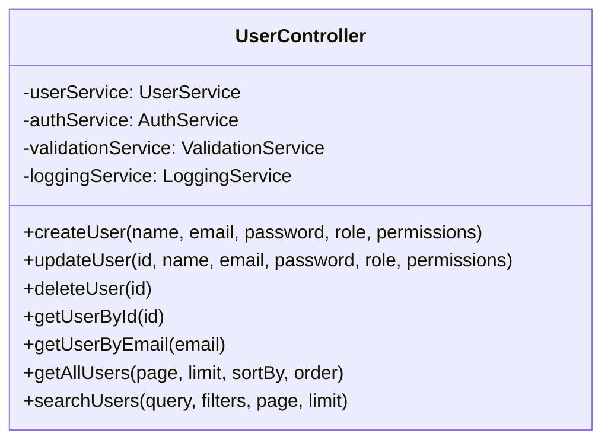

### After（簡素化）

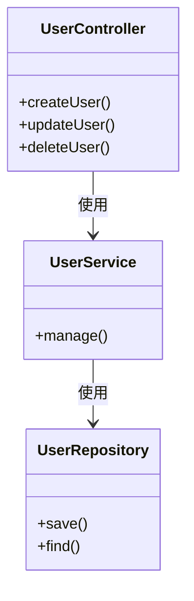

または、複数の図に分割：

**図1: コントローラー層**
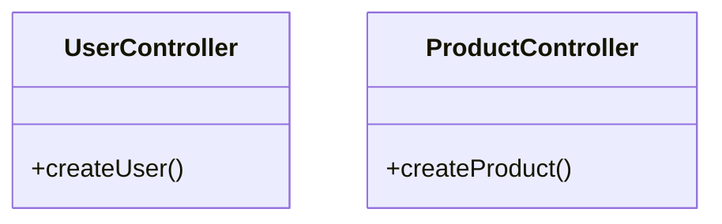

**図2: サービス層**
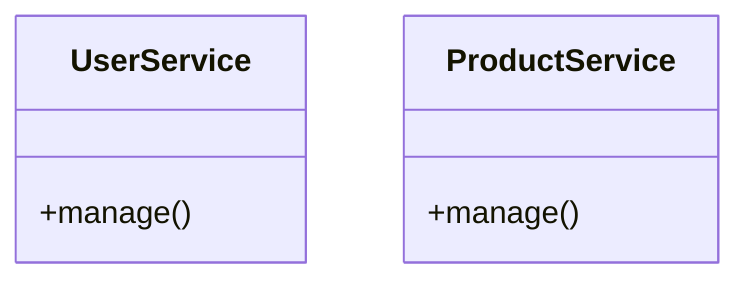

## サポートファイル

詳細情報は以下のファイルを参照：

- `simplification-rules.md`: 簡素化の詳細ルール
- `templates/`: 各図タイプのテンプレート
- `examples/`: 良い例・悪い例

## ベストプラクティス

### 1. 常にシンプルを優先

```
複雑な1つの図 < シンプルな3つの図
```

### 2. プレビューで確認

生成後は必ず：
1. ローカルでプレビュー
2. GitHubでプレビュー
3. エラーがあれば簡素化

### 3. 段階的に構築

```javascript
// 段階的アプローチ
1. 基本構造のみ（5-7要素）
2. プレビュー確認
3. 要素追加（+3-5要素）
4. プレビュー確認
5. 繰り返し（最大15-20要素まで）
```

### 4. ドキュメント化

```markdown
## 図の説明

この図は{目的}を表しています。

### 簡素化の方針
- {方針1}
- {方針2}

### 省略した要素
- {要素1} - 詳細は図X参照
- {要素2} - 詳細は図Y参照
```

## まとめ

このSkillを使用することで：

✅ Mermaid記法でシンプルな図を生成
✅ GitHub、Cursor、VS Codeで表示可能
✅ 表示エラーを回避
✅ 複雑な図は自動で分割提案
✅ 日本語と英語の適切な使い分け

図の作成を依頼する際は、以下を明確にしてください：

1. 図のタイプ（12種類から）
2. 主要な要素（10-15個以内推奨）
3. 表示プラットフォーム（GitHub、VS Codeなど）

最も重要なのは「シンプルさ」です。複雑な図は複数に分割することをためらわないでください。

それでは、シンプルで美しい図の作成を開始しましょう！
