# Mermaid図 簡素化ルール完全ガイド

*バージョン: 1.0.0*
*最終更新: 2025年11月17日*

## 目的

Mermaid図が複雑になりすぎて表示エラーが発生するのを防ぐため、シンプルで可読性の高い図を作成するためのルール集です。

---

## 複雑度の定義

### レベル1: シンプル（✅ 推奨）

- **要素数**: 5-10個
- **階層**: 1-2階層
- **リレーション**: 要素ごとに1-2本
- **ラベル長**: 20文字以内
- **表示**: 問題なし
- **保守性**: 優秀

### レベル2: 標準（⚠️ 注意）

- **要素数**: 11-15個
- **階層**: 2-3階層
- **リレーション**: 要素ごとに2-3本
- **ラベル長**: 30文字以内
- **表示**: ほぼ問題なし
- **保守性**: 良好

### レベル3: 複雑（❌ 避ける）

- **要素数**: 16-20個
- **階層**: 3階層以上
- **リレーション**: 要素ごとに3本以上
- **ラベル長**: 50文字以上
- **表示**: エラーの可能性
- **保守性**: 低い

### レベル4: 過度に複雑（❌❌ 絶対避ける）

- **要素数**: 21個以上
- **階層**: 4階層以上
- **リレーション**: 要素ごとに4本以上
- **ラベル長**: 制限なし
- **表示**: 高確率でエラー
- **保守性**: 非常に低い

---

## 図タイプ別の制限値

### クラス図（classDiagram）

| 項目 | 推奨値 | 最大値 | 
|------|--------|--------|
| クラス数 | 6-8個 | 12個 |
| 属性/クラス | 3-4個 | 6個 |
| メソッド/クラス | 2-3個 | 5個 |
| リレーション | 各クラス2本 | 各クラス3本 |
| ネストクラス | 使用しない | 1階層 |

**複雑度チェック式**:
```
complexity = (classes × 1.0) + (attributes × 0.3) + (methods × 0.3) + (relationships × 0.5)

complexity < 25: シンプル ✅
complexity 25-40: 標準 ⚠️
complexity > 40: 複雑 ❌
```

**例**:
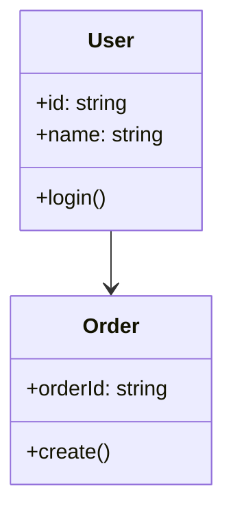

### シーケンス図（sequenceDiagram）

| 項目 | 推奨値 | 最大値 |
|------|--------|--------|
| 参加者数 | 4-5個 | 7個 |
| メッセージ数 | 8-10個 | 15個 |
| ネストactivate | 1階層 | 2階層 |
| alt/opt/loop | 1個 | 2個 |
| ラベル長 | 20文字 | 30文字 |

**複雑度チェック式**:
```
complexity = (participants × 2.0) + (messages × 1.0) + (nesting × 5.0) + (branches × 3.0)

complexity < 30: シンプル ✅
complexity 30-50: 標準 ⚠️
complexity > 50: 複雑 ❌
```

**例**:
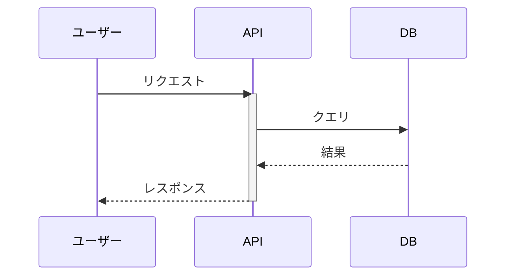

### ステートマシン図（stateDiagram-v2）

| 項目 | 推奨値 | 最大値 |
|------|--------|--------|
| 状態数 | 5-7個 | 10個 |
| 遷移数 | 8-10個 | 15個 |
| 複合状態 | 使用しない | 1階層 |
| 並列状態 | 使用しない | 使用しない |
| ラベル長 | 15文字 | 25文字 |

**複雑度チェック式**:
```
complexity = (states × 1.5) + (transitions × 1.0) + (composite × 5.0)

complexity < 20: シンプル ✅
complexity 20-35: 標準 ⚠️
complexity > 35: 複雑 ❌
```

### フローチャート（flowchart）

| 項目 | 推奨値 | 最大値 |
|------|--------|--------|
| ノード数 | 8-10個 | 15個 |
| エッジ数 | 10-12個 | 20個 |
| サブグラフ | 1-2個 | 3個 |
| 分岐数 | 2-3個 | 5個 |
| ネスト | 1階層 | 2階層 |

**複雑度チェック式**:
```
complexity = (nodes × 1.0) + (edges × 0.8) + (subgraphs × 3.0) + (branches × 2.0)

complexity < 25: シンプル ✅
complexity 25-40: 標準 ⚠️
complexity > 40: 複雑 ❌
```

### ER図（erDiagram）

| 項目 | 推奨値 | 最大値 |
|------|--------|--------|
| エンティティ数 | 5-6個 | 10個 |
| 属性/エンティティ | 4-5個 | 8個 |
| リレーション数 | 6-8個 | 12個 |
| ラベル長 | 20文字 | 30文字 |

**複雑度チェック式**:
```
complexity = (entities × 1.5) + (attributes × 0.3) + (relationships × 1.0)

complexity < 20: シンプル ✅
complexity 20-35: 標準 ⚠️
complexity > 35: 複雑 ❌
```

---

## 簡素化テクニック

### テクニック1: レイヤー分割

**Before（複雑）**:
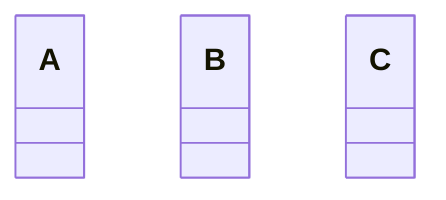

**After（簡素化）**:

**図1: プレゼンテーション層**
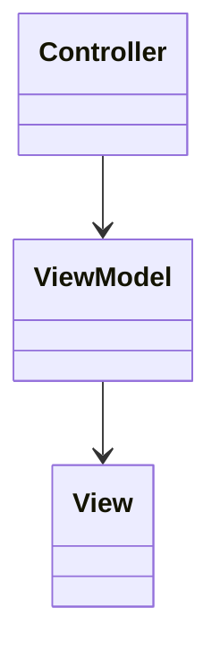

**図2: ビジネス層**
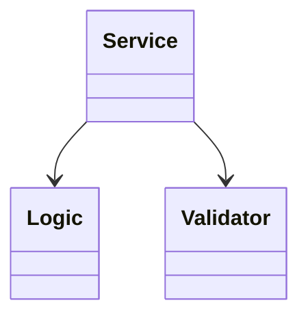

**図3: データ層**
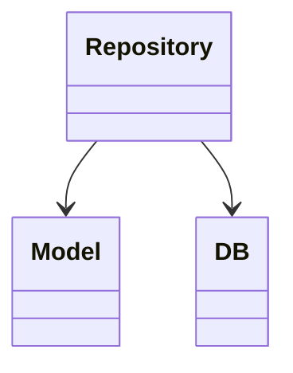

### テクニック2: 関心事の分離

**Before（複雑）**:
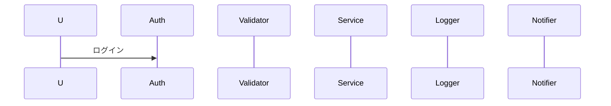

**After（簡素化）**:

**図1: 認証フロー**
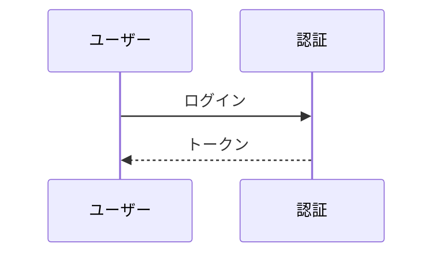

**図2: ビジネスフロー**
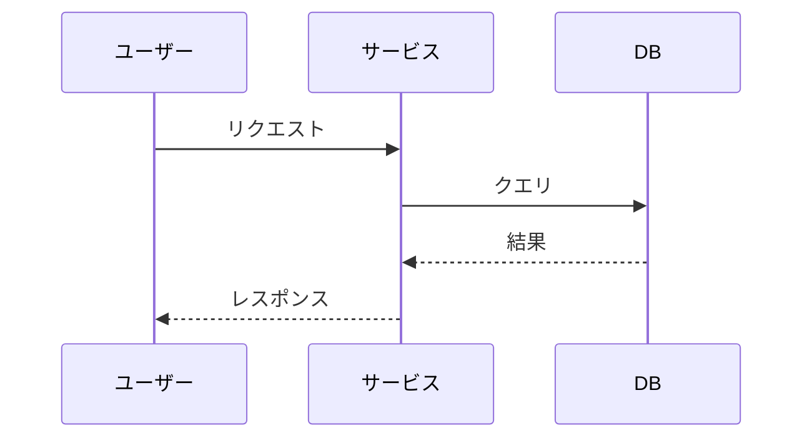

### テクニック3: 抽象化レベルの統一

**Before（詳細すぎる）**:
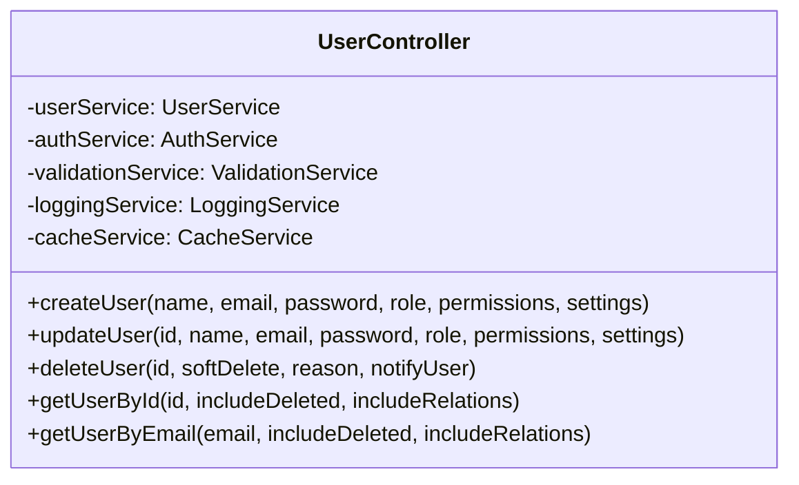

**After（抽象化）**:
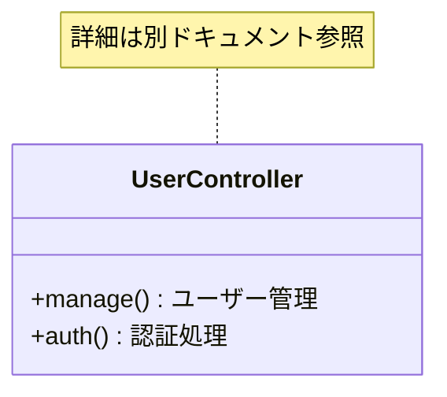

### テクニック4: グルーピング

**Before（散在）**:
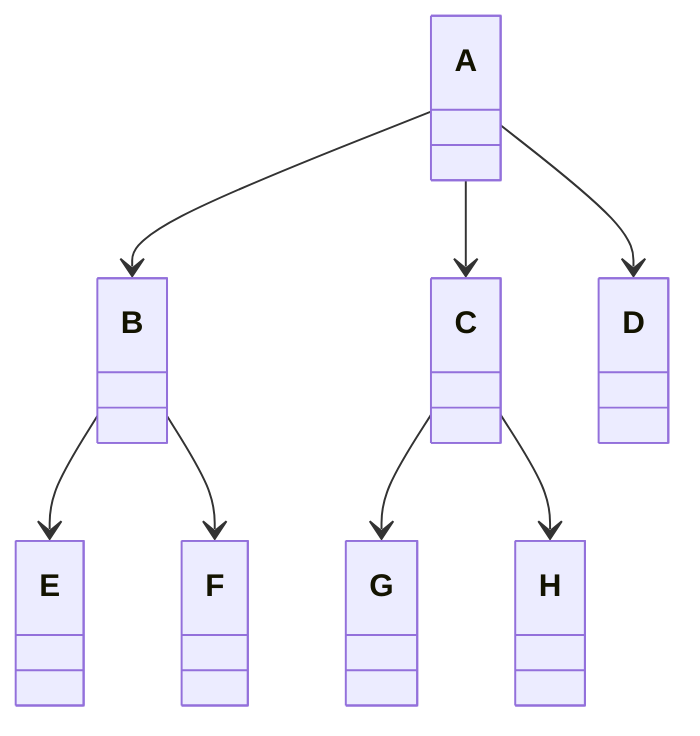

**After（グルーピング）**:
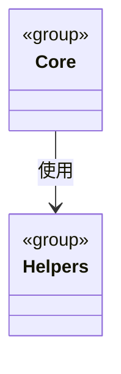

---

## プラットフォーム別の制限

### GitHub

- **レンダリングタイムアウト**: 3秒
- **最大ノード数**: 約50個（実質的には20個推奨）
- **特殊文字**: エスケープ必須
- **改行**: `<br>`は使用可能だが推奨しない

**GitHub最適化例**:
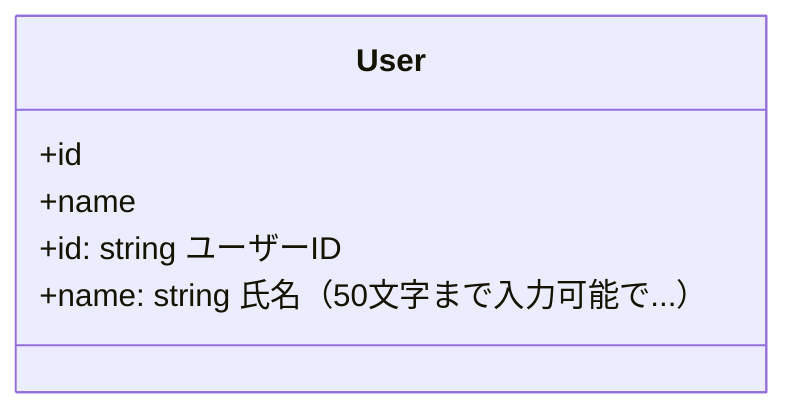

### VS Code / Cursor

- **Mermaid Preview拡張**: リアルタイムプレビュー
- **制限**: GitHub より緩い
- **推奨**: ローカルで確認してからコミット

### Notion / Obsidian

- **エクスポート**: PNG/SVG対応
- **制限**: エディタに依存
- **推奨**: 複雑な図はエクスポートして画像として使用

---

## 自動チェックツール（コンセプト）

```javascript
/**
 * Mermaid図の複雑度を自動チェック
 */
class MermaidComplexityChecker {
  
  check(mermaidCode) {
    const type = this.detectDiagramType(mermaidCode);
    const metrics = this.extractMetrics(mermaidCode, type);
    const complexity = this.calculateComplexity(metrics, type);
    
    return {
      type,
      metrics,
      complexity,
      level: this.getComplexityLevel(complexity),
      recommendations: this.generateRecommendations(complexity, metrics)
    };
  }
  
  detectDiagramType(code) {
    if (code.includes('classDiagram')) return 'class';
    if (code.includes('sequenceDiagram')) return 'sequence';
    if (code.includes('stateDiagram')) return 'state';
    if (code.includes('erDiagram')) return 'er';
    if (code.includes('flowchart')) return 'flowchart';
    return 'unknown';
  }
  
  extractMetrics(code, type) {
    const lines = code.split('\n');
    
    const metrics = {
      totalLines: lines.length,
      elementCount: 0,
      relationshipCount: 0,
      nestingDepth: 0,
      labelLengths: []
    };
    
    switch (type) {
      case 'class':
        metrics.elementCount = (code.match(/class\s+\w+/g) || []).length;
        metrics.relationshipCount = (code.match(/--|>|\.\.>|<\|--|--|>/g) || []).length;
        break;
      case 'sequence':
        metrics.elementCount = (code.match(/participant\s+\w+/g) || []).length;
        metrics.relationshipCount = (code.match(/->|-->/g) || []).length;
        break;
      case 'er':
        metrics.elementCount = (code.match(/\w+\s+\{/g) || []).length;
        metrics.relationshipCount = (code.match(/\|\|--|\}o--/g) || []).length;
        break;
    }
    
    return metrics;
  }
  
  calculateComplexity(metrics, type) {
    const weights = {
      class: { element: 1.0, relationship: 0.5, nesting: 5.0 },
      sequence: { element: 2.0, relationship: 1.0, nesting: 5.0 },
      state: { element: 1.5, relationship: 1.0, nesting: 5.0 },
      er: { element: 1.5, relationship: 1.0, nesting: 0 },
      flowchart: { element: 1.0, relationship: 0.8, nesting: 3.0 }
    };
    
    const w = weights[type] || weights.flowchart;
    
    return (
      metrics.elementCount * w.element +
      metrics.relationshipCount * w.relationship +
      metrics.nestingDepth * w.nesting
    );
  }
  
  getComplexityLevel(complexity) {
    if (complexity < 25) return 'simple';
    if (complexity < 40) return 'moderate';
    return 'complex';
  }
  
  generateRecommendations(complexity, metrics) {
    const recommendations = [];
    
    if (metrics.elementCount > 15) {
      recommendations.push({
        severity: 'high',
        message: '要素数が多すぎます。図を複数に分割してください。',
        action: '機能別またはレイヤー別に分割'
      });
    }
    
    if (metrics.relationshipCount > metrics.elementCount * 2) {
      recommendations.push({
        severity: 'medium',
        message: '関係が多すぎます。主要な関係のみに絞ってください。',
        action: '依存関係を精査し、重要なもののみ残す'
      });
    }
    
    if (metrics.nestingDepth > 2) {
      recommendations.push({
        severity: 'high',
        message: 'ネストが深すぎます。階層を浅くしてください。',
        action: 'サブグラフや複合状態を削減'
      });
    }
    
    return recommendations;
  }
}

// 使用例
const checker = new MermaidComplexityChecker();
const result = checker.check(mermaidCode);

console.log(`複雑度レベル: ${result.level}`);
console.log(`複雑度スコア: ${result.complexity}`);
console.log(`推奨事項:`);
result.recommendations.forEach(rec => {
  console.log(`  [${rec.severity}] ${rec.message}`);
  console.log(`    → ${rec.action}`);
});
```

---

## 簡素化フロー

```
1. 要件収集
   ↓
2. 複雑度評価
   ├─ シンプル → そのまま生成
   ├─ 標準 → 簡素化を検討
   └─ 複雑 → 必ず簡素化
   ↓
3. 簡素化戦略選択
   ├─ レイヤー分割
   ├─ 関心事分離
   ├─ 抽象化
   └─ グルーピング
   ↓
4. 図生成
   ↓
5. プレビュー確認
   ├─ エラーなし → 完了
   └─ エラーあり → ステップ3へ戻る
```

---

## まとめ

### 簡素化の原則

1. **1図1目的**: 1つの図で1つのことを表現
2. **10-15ルール**: 要素数は10-15個以内
3. **2-3階層**: ネストは2-3階層まで
4. **20-30文字**: ラベルは20-30文字以内
5. **分割優先**: 複雑なら迷わず分割

### チェックリスト

図を生成する前に：

- [ ] 要素数は15個以内か？
- [ ] ネストは3階層以内か？
- [ ] ラベルは30文字以内か？
- [ ] リレーション数は適切か？
- [ ] 1つの目的に絞られているか？

図を生成した後に：

- [ ] ローカルでプレビュー確認したか？
- [ ] GitHubでプレビュー確認したか？
- [ ] エラーは発生していないか？
- [ ] 可読性は十分か？
- [ ] ドキュメント化したか？

これらのルールに従うことで、常に**表示エラーのない、シンプルで美しいMermaid図**を作成できます。

---

## よくある構文エラーと回避方法 🚫→✅

このセクションでは、Mermaid図生成時によく発生する構文エラーと、その回避・修正方法を説明します。

### 1. 矢印記法のエラー

#### ❌ エラー例

```mermaid
classDiagram
    A -> B   %% 無効な矢印
    C > D    %% 無効な矢印
```

#### ✅ 正しい記法

```mermaid
classDiagram
    A --> B   %% 関連
    C --|> D  %% 継承
    E ..> F   %% 依存
```

**有効な矢印一覧**:
- `-->`: 関連
- `--`: 線のみ
- `-.->`: 点線関連
- `==>`: 太線関連
- `--|>`: 継承
- `..|>`: 実装
- `--o`: 集約
- `--*`: コンポジション

### 2. 特殊文字のエスケープエラー

#### ❌ エラー例

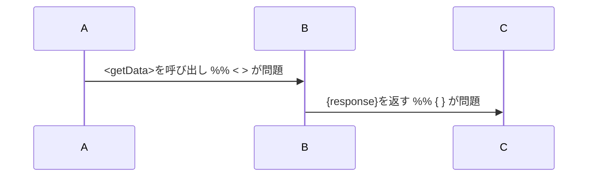

#### ✅ 正しい記法

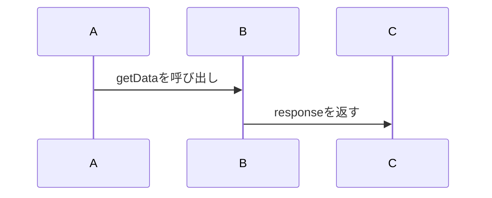

**回避方法**:
- 特殊文字 `< > { } # ( )` は可能な限り使用しない
- クラス図のメソッド定義内のみ `()` 使用可能
- どうしても必要な場合は引用符で囲む: `"<getData>()"`

### 3. 引用符の閉じ忘れ

#### ❌ エラー例

```mermaid
flowchart TD
    A["ユーザー登録] --> B[確認]   %% 引用符が閉じていない
```

#### ✅ 正しい記法

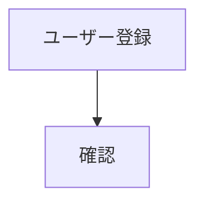

### 4. 無効なダイアグラム宣言

#### ❌ エラー例

```mermaid
class-diagram   %% ハイフンは無効
sequencechart   %% chartは無効
```

#### ✅ 正しい記法

```mermaid
classDiagram
sequenceDiagram
stateDiagram-v2
erDiagram
flowchart TB
```

**有効な宣言**:
- `classDiagram`
- `sequenceDiagram`
- `stateDiagram-v2` (v2必須)
- `erDiagram`
- `flowchart TB/TD/LR/RL`
- `graph TB/TD/LR/RL` (非推奨、flowchart推奨)

### 5. コメントの誤った記法

#### ❌ エラー例

```mermaid
classDiagram
    // これはコメント      %% 無効（JavaScriptスタイル）
    <!-- コメント -->     %% 無効（HTMLスタイル）
```

#### ✅ 正しい記法

```mermaid
classDiagram
    %% これがMermaidのコメント
```

### 6. ネストの深すぎる図

#### ❌ エラー例（複雑すぎる）

```mermaid
sequenceDiagram
    A->>B: リクエスト
    alt 認証成功
        B->>C: データ取得
        alt データあり
            loop 各データ
                alt 有効
                    C->>D: 処理   %% 3階層目のネスト
                end
            end
        end
    end
```

#### ✅ 正しい記法（簡素化）

```mermaid
sequenceDiagram
    A->>B: リクエスト
    alt 認証成功
        B->>C: データ取得
        C->>D: 処理
    else 認証失敗
        B->>A: エラー
    end
```

**ルール**: ネスト（alt, loop, opt）は2階層まで

### 7. 日本語ラベルの問題

#### ❌ エラー例

```mermaid
classDiagram
    class ユーザークラス   %% クラス名に日本語（非推奨）
```

#### ✅ 正しい記法

```mermaid
classDiagram
    class UserClass {
        <<ユーザー>>   %% ステレオタイプとして日本語使用
    }
```

**推奨**: クラス名・メソッド名は英語、説明・ラベルに日本語

### 8. 要素数の超過

#### ❌ エラー例

```mermaid
classDiagram
    %% 20個以上のクラスを定義...
```

#### ✅ 正しい記法

**図を分割**:

```mermaid
%% 図1: プレゼンテーション層
classDiagram
    class Controller
    class View
    class Router
```

```mermaid
%% 図2: ビジネス層
classDiagram
    class Service
    class Repository
```

---

## 構文エラー検出パターン（パターンマッチング）

Mermaidコードを生成後、以下のパターンでエラーをチェックできます：

### チェック1: 無効な矢印

**検出パターン**:
```regex
(?<!-)->(?!>)   # 単一の > を検出
(?<!\.\.)\.\. (?!\.)   # 単一または奇数個の . を検出
```

### チェック2: 閉じていない引用符

**検出パターン**:
```regex
"[^"]*$   # 行末で閉じていない "
\[[^\]]*$   # 行末で閉じていない [
```

### チェック3: 無効な宣言

**検出パターン**:
```regex
^(?!classDiagram|sequenceDiagram|stateDiagram-v2|erDiagram|flowchart|graph)
```

### チェック4: JavaScriptスタイルのコメント

**検出パターン**:
```regex
^\s*//   # 行頭の //
<!--     # HTMLコメント
```

### チェック5: ラベルの長さ

**検出パターン**:
```regex
["[](.{31,})["\]]   # 31文字以上のラベル
```

---

## エラー自動修正の例

### 修正1: 無効な矢印の置換

```javascript
// 無効な矢印を有効な矢印に変換
code = code.replace(/(?<!-)>(?!>)/g, '-->');
code = code.replace(/(?<!-)-(?!-)/g, '-->');
```

### 修正2: 特殊文字の除去

```javascript
// ラベル内の特殊文字を除去
code = code.replace(/<([^>]+)>/g, '$1');
code = code.replace(/\{([^}]+)\}/g, '$1');
```

### 修正3: 長いラベルの短縮

```javascript
// 30文字を超えるラベルを短縮
code = code.replace(/"([^"]{28})[^"]{3,}"/g, '"$1..."');
```

---

## 禁止パターン一覧（図タイプ別）

### クラス図

**禁止**:
- クラス名に特殊文字: `class User<T>`（ジェネリクスは非サポート）
- 複数行の属性定義
- ネストされたクラス定義

**推奨**:
```mermaid
classDiagram
    class User {
        +id: string
        +getName() string
    }
```

### シーケンス図

**禁止**:
- 未定義の参加者へのメッセージ
- 4階層以上のネスト（alt, loop, opt）
- 複数の並行ブロック（par）の過度な使用

**推奨**:
```mermaid
sequenceDiagram
    participant A
    participant B
    A->>B: メッセージ
    alt 条件
        B->>A: 応答1
    else
        B->>A: 応答2
    end
```

### ステートマシン図

**禁止**:
- 3階層以上の状態のネスト
- 循環する遷移の複雑な定義
- [*]以外の特殊状態

**推奨**:
```mermaid
stateDiagram-v2
    [*] --> Active
    Active --> Inactive
    Inactive --> [*]
```

### ER図

**禁止**:
- 多対多の直接関係（中間テーブル推奨）
- 10個以上の属性
- ネストされたエンティティ

**推奨**:
```mermaid
erDiagram
    USER ||--o{ ORDER : places
    USER {
        int id PK
        string name
    }
```

---

---

*最終更新: 2025年11月17日 13:30 JST*  
*著作権: (c) 2025 KEIEI.NET INC.*  
*作成者: KENJI OYAMA*  
*バージョン: 1.1.1*
